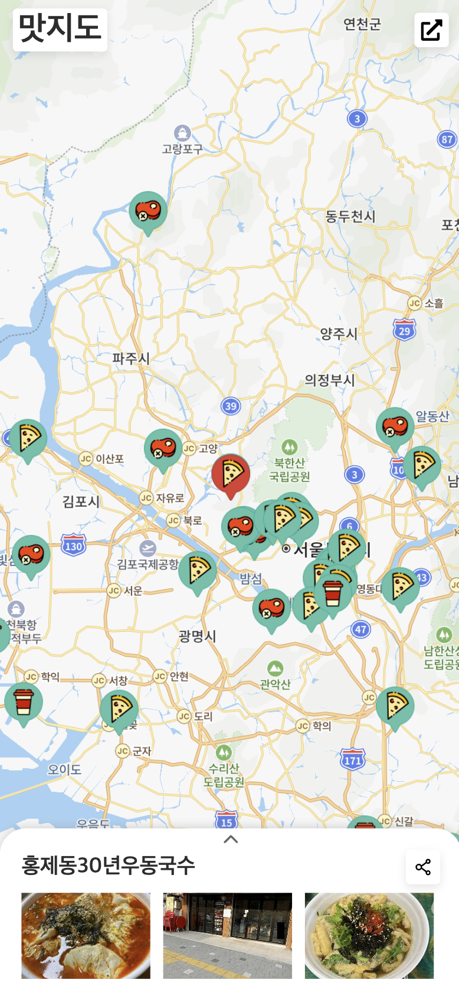
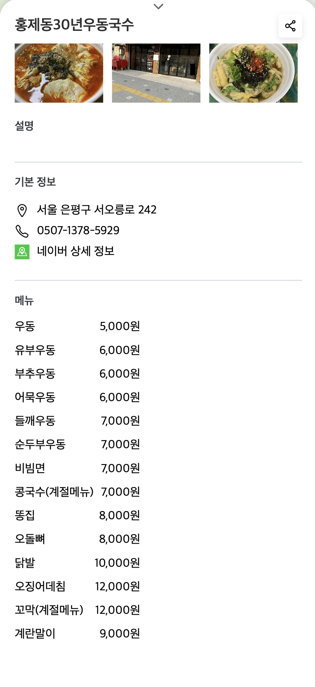

<h1 align="middle">next map app</h1>

nextjs 강의를 듣고 실습으로 만든 맛집 지도 서비스입니다.

  
  
  

## 💻 미리보기

  
  

## 🎯 구현 사항

- [ ] 네이버 지도 API 연동 및 마커 등록
- [ ] 완성된 웹사이트를 vercel로 배포
- [ ] 웹 성능, 웹 접근성, SEO 개선(Chrome Lighthouse를 이용해 웹 성능 검사)
- [ ] 네이버 서치어드바이저와 Google Search Console에 사이트를 등록 / Google Analytics 사용

## 📖 강의

- [Next.js 시작하기](https://www.inflearn.com/course/nextjs-%EC%8B%9C%EC%9E%91-%EC%A7%80%EB%8F%84%EC%84%9C%EB%B9%84%EC%8A%A4/)
